# FLAKS Flexarm

### Free Range Arm Kinematics System

The Flaks Flexarm is a tool-balancing arm designed to keep the attached tool parallel throughout its movement. It was created to hold soldering irons to install heat set inserts into 3d printed parts.

It has a large working area for its size, and has quick release tool holders that are held in place with magnets.

___

# What do I need?

* You will also need either pocket screws or a wood working fence clamp to secure the base to your work surface.

* 4 pieces of 1515 extrusion, all cut to the same length and tapped on either end. I have tested this with 200mm and 270mm lengths.

* 10x1x60mm extension springs, these seem to work well for 200-300mm builds. You can adjust the tension rate by moving the spring posts along the 1515 extrusion.

* 10x100mm dowel pin and a 10x14x30mm brass Bushing

* M10 washer, a 25mm diameter is listed, but any diameter and thickness washer will work.

* M5x30 FHCS are recommended, but BHCS are also supported. The springs will touch button heads slightly, but will not affect performance from testing.

* You will need a Soldering iron with a heatset insert adapter. I personally recommend either the Pinecil or TS101 Soldering Irons along with the adapter set from CNC Kitchen.

| **Current Supported Irons:**                           |                                                                                    |
|--------------------------------------------------------|------------------------------------------------------------------------------------|
| **Pinecil** with CNC Kitchen TS100&TS101 Adapter Set   |                           |
| **TS101** with CNC Kitchen TS100&TS101 Adapter Set     |                              |
| Imported adjustable solder iron (Generic)              |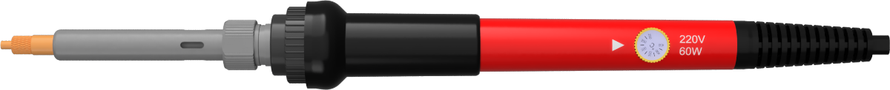 |

___

## BOM

| Part Description                                          | Quantity |                                                                           |
|-----------------------------------------------------------|----------|---------------------------------------------------------------------------|
| 1515 Extrusion 200-300mm (All the same length)            | 4        |    |
| 10mm OD x 1mm Wire Gauge x 60mm Long Extension Springs    | 4        |    |
| 10mm x 100mm long Pin                                     | 1        |                   |
| 10mm ID x 14mm OD x 30mm Length Brass Bushing             | 1        | |
| 10mmx24mm Washer                                          | 1        |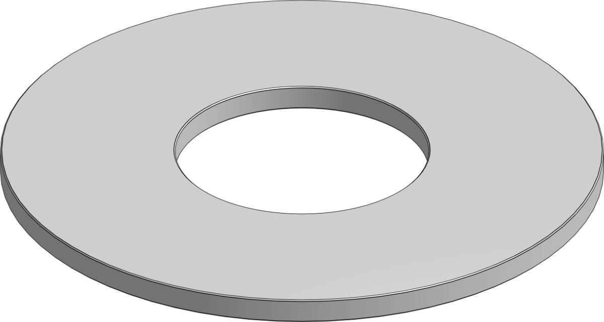         |
| M3x8 FHCS                                                 | 16       |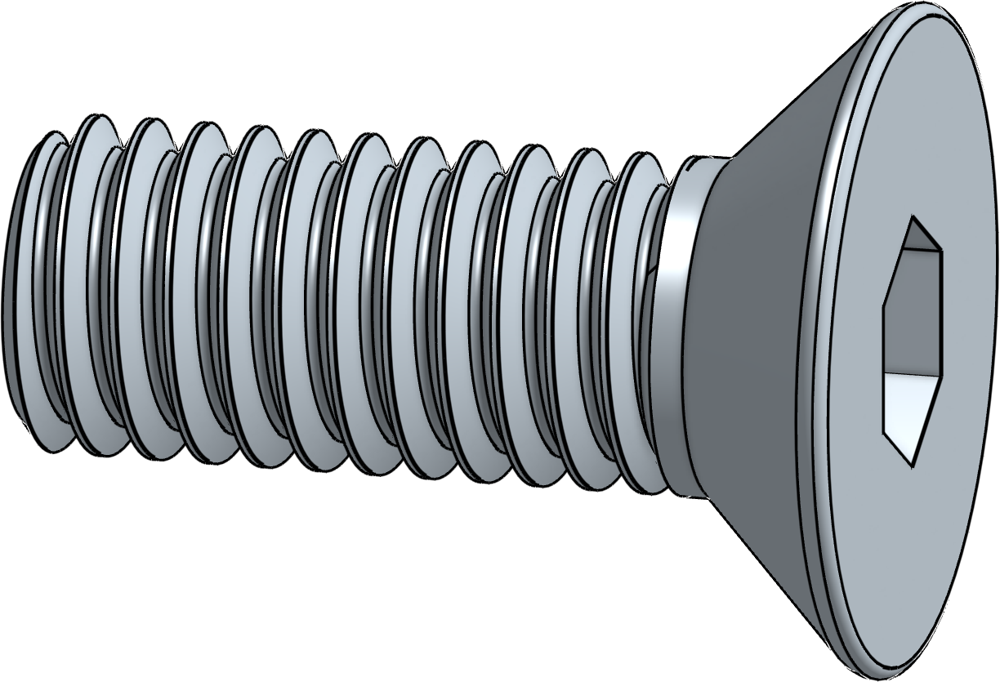               |
| M3x8 SHCS                                                 | 10       |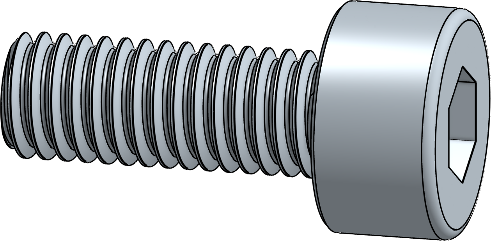               |
| M3x12 BHCS                                                | 4        |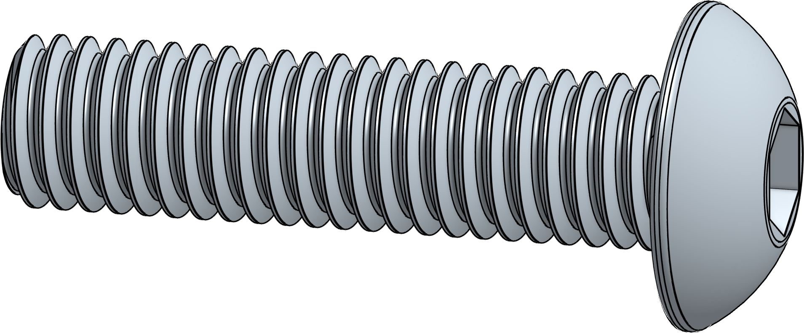             |
| M3x20 BHCS                                                | 4        |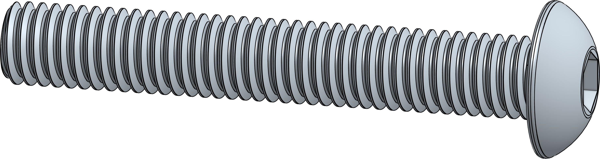             |
| M5x30 FHCS (Or BHCS)                                      | 8        |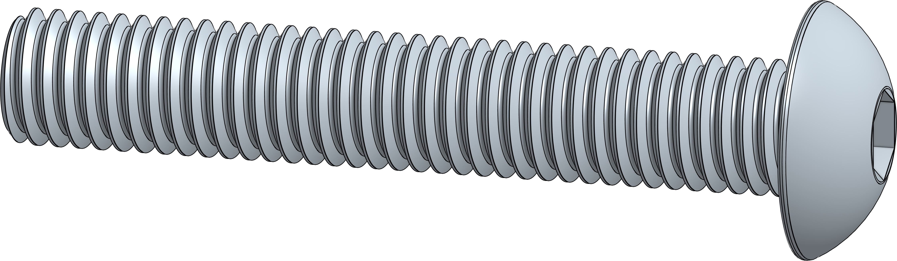             |
| M3 Heatset Inserts (5mm OD x 4mm Length)                  | 10       |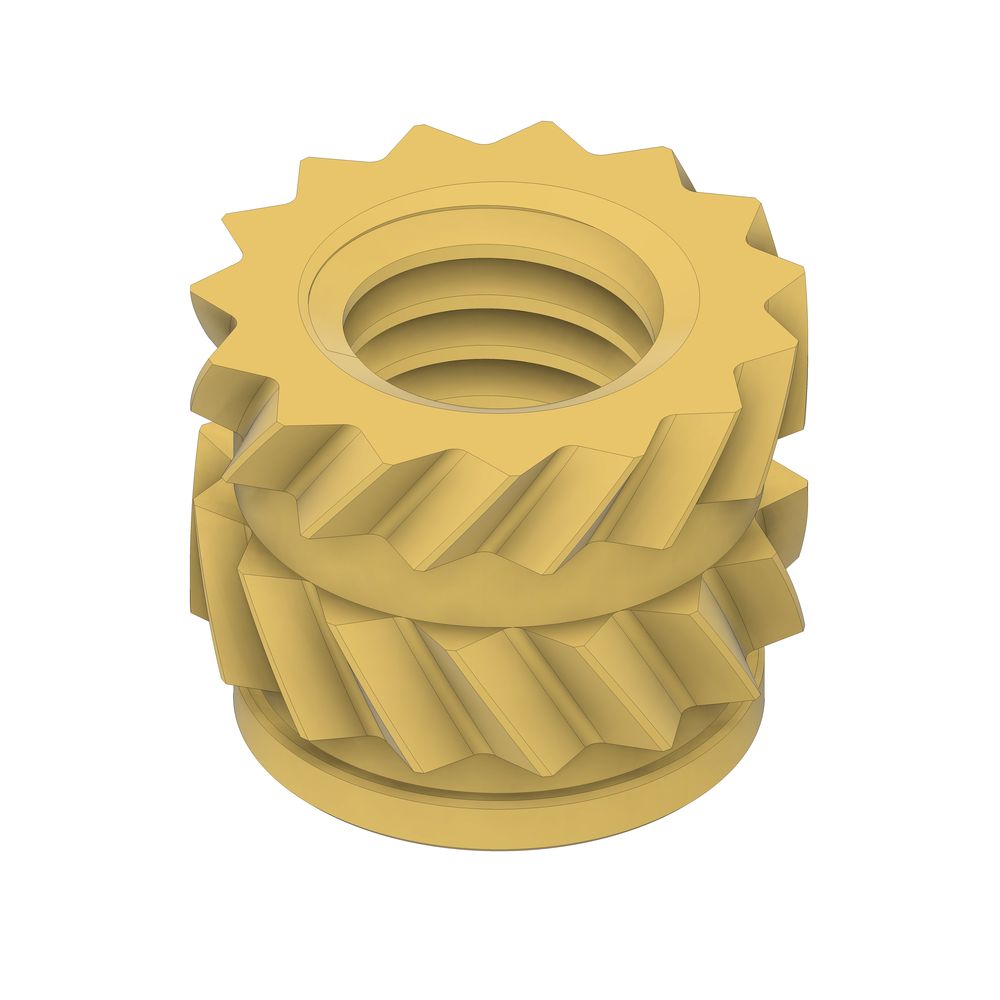   |
| M3 Hex Nuts                                               | 20       |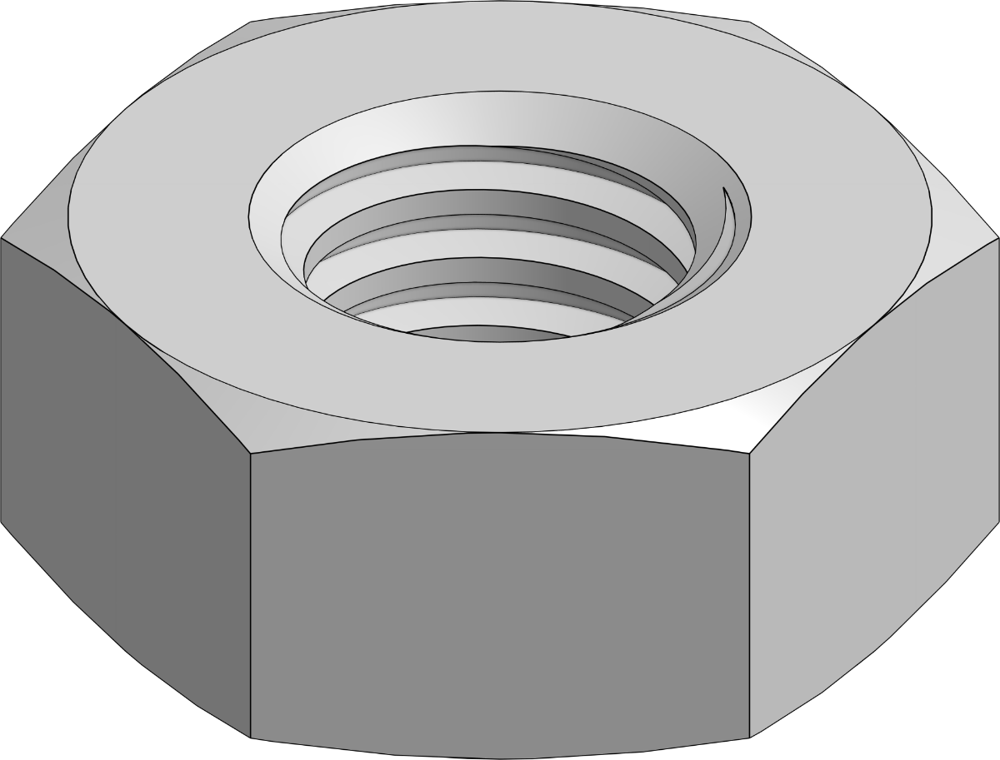             |
| M5 Washers/Shims (10x1)                                   | 16       |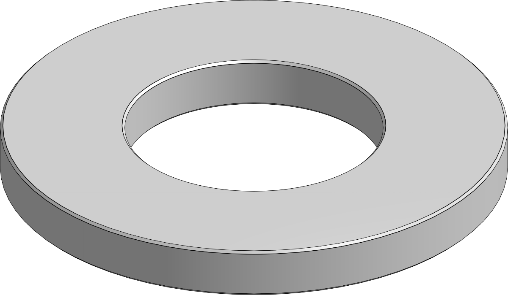         |
| 6x3 Magnets                                               | 2        |             |
| 6x2 Magnets (For Gridfinity Base)                         | 12       |             |
| 1-1/4 #8 Pocket screws (For screwing base to table)       | 4        |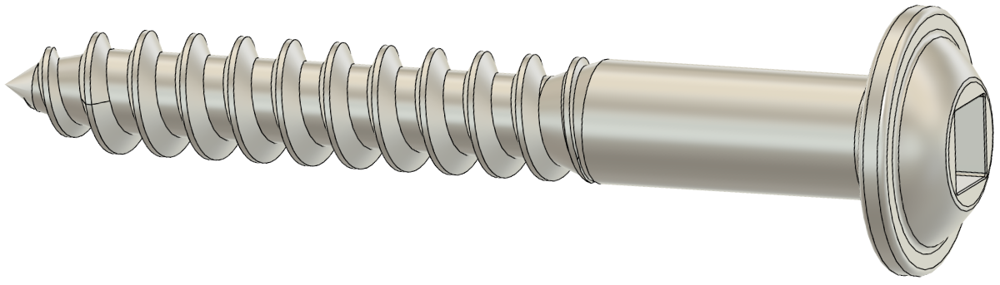         |
| Table Saw Fence Clamp (For clamping to table)             | 1        |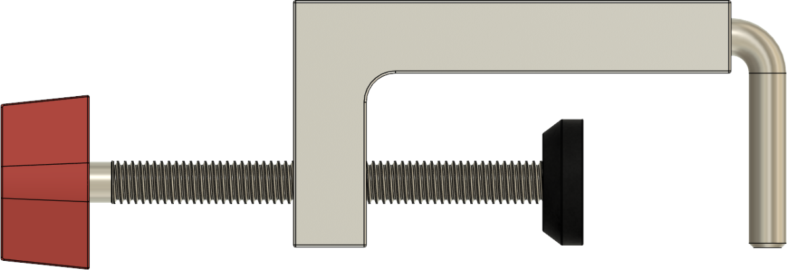          |

 

___

# Assembly Tips

___

* The center arms use a pair of magnets to pull the arms together when parked. Build 2 arms with magnets that that attract to each other.

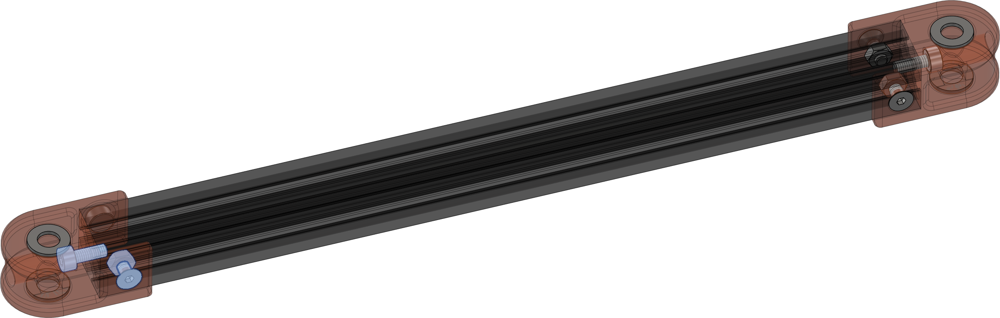

* Build the other 2 arms like the image bellow, with the spring standoffs placed 90mm from one end. You can adjust these later.

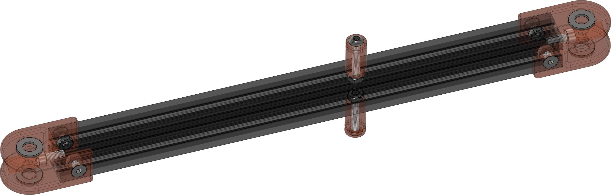
